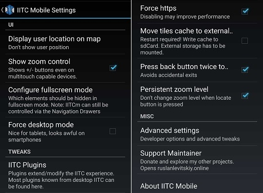
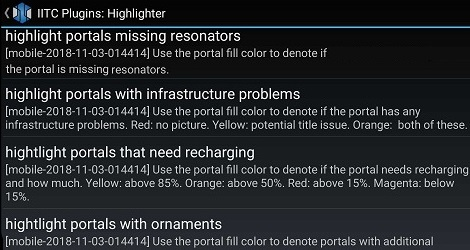
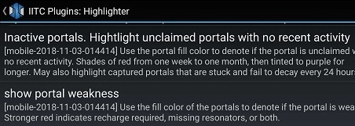

## How to iitc
인그레스를 도와주는 도구앱인 iitc의 기초적인 활용법을 소개하는 문서.   

### [개요]
iitc는 별도의 전용 네이티브 앱인 것처럼 보이지만, 실은 인그레스 intel 사이트에서 
제공되는 화면 정보를 변경하고 wrapping하여 보여주는 기본 구조를 지녔습니다.  

따라서 런타임 로딩속도가 (인텔사이트와 똑같이) 느릴 수 있고, 로딩되는 도중에는
사용자의 입력을 제대로 처리하지 못하기도 합니다. 화면 상단에 파란색 막대 그래프가
끝까지 완료되는 것을 기다리며 사용하길 권장합니다.  

### [기본 화면]
스마트폰에서 iitc를 실행하면 대략 아래와 같은 화면을 보게 됩니다.  
실행되자마자 아직 정보로딩이 안된 왼쪽 상태에서, 시간이 걸려 로딩이 마쳐지면 
오른쪽처럼 포탈과 링크필드 및 추가 정보들이 보이게 됩니다.  
  
위 화면 캡쳐는 설정에서 여러가지 부가 기능을 켜둔 상태를 보여주고 있습니다.  
* 화면 좌단 zoom control +/-버튼  
  * 줌버튼 사이에 줄자 zoom slider  
* 오각형/선분/체크/휴지통 등 draw tools
  * KML 파일 열기 버튼 (폴더 아이콘)
  * 삼각형이 그려진 layer count 버튼
* 우하단에 고배율 지도 mini map
* 약 1cm남짓 척도의 화면 실제 거리 scale bar
* (참고로, 이 control들은 로딩상황상 순서가 서로 뒤바뀔 수 있음)

### [상단 Title bar의 메뉴들]
가장 상단에는 앱 이름과 여러 기능들이 배치되며, 화면 크기에 따라 
점세개 버튼으로 접혀 메뉴로 사용 가능하게 됩니다.  
(참고로, 아래 설명할 Advanced / Configure menu 에서 표시될 구성을 바꿀 수 있습니다.)  

기능들은 아래와 같습니다.  
* Logs : 좌측 끝 三(햄버거)를 누르면 로그를 볼 수 있는 화면이 나옵니다.  
  * 지도에 대한 책갈피 기능을 여기에서 사용하는 방법이 추후 설명됩니다. (PI / Controls / Bookmarks)  
* Search : 지도상 검색이 가능합니다.  
  * (포탈 이름 검색이 아니라 지도 서비스 상 검색기능)  
* Location : 현재 위치를 지도 중앙에 리셋하거나 stick 하는 기능.  
* Fullscreen : 누르면 타이틀바를 없애고 전체 화면으로 넒게 보기 (back 버튼으로 복귀)  
* Reload : 화면 정체 및 오류 상황을 극복하기 위해 화면 전체를 다시 로드함.  
* Layer chooser : 아래 설명할 "정보별 표출 여부" 선택 기능.  
  * 참고로 화면 우측 바깥에서 안쪽으로 스와이프 해도 레이어츄저 사용 가능하며, 풀스크린에서 유용함.  
* Send screenshot : 현재 장면 캡쳐 공유 기능.  

본 문서에서는 주로 Settings 내 설정 기능들을 설명하게 될 것입니다.  

### [Settings 메뉴]
Settings를 누르면 하위 메뉴들을 볼 수 있습니다.  
  
체크박스와 함께 있는 메뉴는 on/off 토글이 가능합니다.  
* Show zoom control : 화면 좌상단에 확대축소를 위한 + - 버튼을 표출함.  
  * (모바일에서 핀칭줌을 하겠지만, 버튼으로도 하게 해준다는 의미)  
  * 아래 설명할 "줌슬라이드"를 사용하려면 줌컨트롤을 켜둬야 함.  
* Press back twice : back 실수로 앱종료되는 것을 방지함.  
* Persistent 줌레벨 : 선택한 지도 축척이 함부로 변경되지 않게 함.

이 메뉴 중에 하위 메뉴가 많아서 별도로 설명하게 되는 메뉴 2가지는 
"IITC Plugins" 메뉴와 "Advanced settings" 메뉴입니다. 

### [Advanced 메뉴]
내용이 적은 Advanced 쪽을 먼저 살펴보자면 아래와 같습니다.  
  
* Developer 모드 : 개발자들을 위한 기능  
* Configure menu : 타이틀바에서 없앨 메뉴 설정 가능  
* Disable Splash : 첫 실행시 뜨는 대문 화면 스킵  
등등의 설정이 가능합니다.  

마지막 항목인 Fake Agent 기능을 켜면 스마트폰 전체 설정에서 인증 연계되는 
자동 로그인 방식이 아니라 iitc앱 실행 상에서 따로 띄워지는 로그인 화면을 
통해 사용이 가능합니다.  
(로그인 화면 무한 반복시 해결 방법으로 사용되기도 함.)

### [IITC Plugins 메뉴]
가장 길고 많은 내용을 가진 Plugins (이하 PI) 메뉴에 들어가보면 아래와 같습니다.  
  
11가지 범주로 기능설정이 분류되어 있습니다.  
주로 설정하게 되는 것은 Control, Highlighter, Layer 등이고...  
Potal Info 및 Tweak 쪽에도 일부 설정할 기능이 있습니다.  

### [PI / Controls]
Controls 플러그인에는 설정하여 사용할 기능이 많습니다.  
  
"Bookmarks for maps and portals" 체크박스를 켜두면...  
iitc를 사용하다가 특정 지역을 특정 배율로 보던 상태를 저장하거나 
다시 로드할 수 있는 메뉴가 활성화됩니다. 서로 다른 여러 지역에 
관심사가 있을 때 각 지역과 배율을 "지도 책갈피"처럼 지정해 두고 
손쉽게 원클릭으로 오가며 현재 동향을 살펴보게 됩니다.  
  

iitc 앱 화면 타이틀바 왼쪽 햄버거(三) 버튼을 누르면 Info 및 Log 메뉴가 
나오는데, bookmark 체크를 켜면 위 그림과 같이 Bookmarks 메뉴가 생깁니다.  
  
+Map을 누르면 현재 화면의 위치와 배율이 저장되어 나중에 원클릭으로 
로드 가능해집니다. "Show X button"을 눌러서 책갈피를 지울 수 있습니다.  
책갈피가 많은 경우 폴더로 정리할 수 있고 Show move button으로 순서 등을 
정리할 수 있습니다.  

그 외 기능들은 아래와 같으며, 문서 도입부 첫 스샷에서 대부분 설명되었습니다.  
* Mini map : 화면 우하단에 줌아웃된 지도를 표기.  
  * (복잡한 포탈 등 정보 없이 지도만 보여줌)  
* pan control : 상하좌우 이동키 표출.  
  * (한 페이지 씩 패닝하여 드래그 로딩 충돌 방지)  
* scale bar : 지도의 실제 거리를 알 수 있는 축적자 표출.
* zoom slider : 줌인 줌아웃 한번에 가능한 축적 줄자 표출.  
  * (줄자 위에 원클릭으로 특정 배율 한번에 로딩 가능)  

iitc에서 가장 불편한 점이 로딩중인 화면을 계속 조작하게 되는 충돌성이기에, 
이 control들을 활용하면서 화면 터치를 최소화하면 다소 쾌적한 사용이 가능합니다.  

### [PI / Highlighter]
Highlighter 설정에서는 주로 포탈을 나타내는 작은 동그라미 위에 나타낼 
정보들을 선택합니다.  
  
  
  
대부분의 기능은 제곧내 설명이 잘 쓰여져 있습니다.  
ornaments 표시 기능의 경우 이벤트에 따른 특수 포탈들의 정보를 표기하기도 
하고, scan 관련 부가 정보를 나타내주기도 합니다.  

### [PI / Info & Keys & Misc]
Info plug-in 범주에는 아래와 같은 기능들이 모여 있습니다.  
  
  
layer count 기능을 켜면 표시되는 "삼각형 그려진 버튼"을 누른 후 
지도 상 필드를 클릭하면 몇겹이 겹친 필드인지 숫자로 알려줍니다.

Keys 및 Misc 분류는 다음과 같습니다.  
   

### [PI / Layers]
Layer 분류에 설정할 것들이 많습니다.  
  
  
  
먼저 설명할 것으로, draw tools 체크를 켜둬야 합니다. 
드로우툴즈 기능은 지도 위에 임의의 도형을 그려서 객체로 존재하게 해줍니다.  
본 레이어의 기능들 대부분이 드로우툴즈의 기능을 기본으로 동작하므로, 
해당 체크를 항상 켜두게 됩니다. 그려진 도로윙 객체는 지우개(쓰레기통) 
버튼으로 지울 수 있습니다.  

cross links 기능과 done links는 유사하게 묶인 기능으로써... 
지도 상에 임의로 링크를 구성해보고 필드를 도안해볼 때애, 내가 그려보는 
링크를 방해하는 기존 링크를 붉은 점선으로, 이미 존재하는 링크를 내가 겹쳐 
그린 경우를 푸른 점선으로 표시해주는 기능입니다.

Fly links 기능과 Max links 기능은 지금 지도 화면에서 가장 많은 필드 수 
혹은 링크 숫자를 생성할 수 있는 최적해를 알려주는 기능입니다. 이 기능을 
켜면 아래 그림처럼 붉은 링크 필드로 최적의 예를 안내해 줍니다.  
  
메인 화면 사용 중 이 기능을 켜고 끄려면 화면 오른쪽 밖에서 안쪽으로 
스와이프 하면 나오는 Layer chooser 체크 박스를 활용하면 됩니다.  

Map tiles 항목에서는 지도의 배경 그림이 되는 지도 서비스를 선택합니다.  
  
  
인그레스가 그렇듯 iitc도 기본적으로 구글 지도를 사용하는데, 
그 외에 다양한 iitc 호환 가능 지도 서비스들이 여기에 리스트업 됩니다. 
여기에서 체크를 켜둔 타사 지도 서비스들이 Layer chooser 메뉴에 보여져서 
선택 가능해집니다.  
이 지도 서비스의 로딩 속도도 iitc를 사용하는 체감속도에 큰 영향을 주게 
되므로 느리지 않은 서비스를 잘 선택해야 합니다. (사용자 상황에 따라 다름)  

### [PI / Portal Info]
Portal Info 항목들은 아래와 같습니다.  
  
Show linked portals 체크를 켜두면 어떤 포탈을 선택하고 우 하단 정보탭을
클릭해서 포탈 내용 화면을 띄웠을 때에 포탈 사진란에 링크 연결된 포탈들이 
무엇인지 정사각형들로 표시해주게 됩니다.  
로딩이 충분하다면 그 포탈들의 사진과 거리를 표시해주며, 클릭도 가능합니다.  

### PI / Tweaks
Tweaks 분류에는 아래와 같은 항목들이 있습니다.  
  
Periodic refresh 체크를 켜두면 적정 시간마다 다시 현재 상황으로 리로드 됩니다.  
Show less portals 옵션은 줌 레벨과 무관히 모든 포탈을 로드하는 기능 관련인데, 
잘못 사용시 서버 과부하 및 사용자 불편을 야기한다고 하니 주의가 필요합니다.  
Show directions of links 기능은 링크의 방향성 (out/in)을 보여주는 기능이며, 
info tap 정보 화면에 있는 여러 버튼 중 Link Direction 버튼으로 사용하게 됩니다.

### [Layer chooser]
기본 화면에서 사용 중에 오른쪽 바깥쪽에서 안쪽으로 스와이프하면
Layer chooser 메뉴가 나오는데, 내용이 많아서 상하 스크롤 하며 사용합니다.  
  

### [Tap for info / Info screen]
다시 메인 화면을 보면서 설정된 부분별 기능을 보자면 다음과 같습니다.  
  
화면 좌측 하단에 포탈 이름이 쓰여진 부분을 클릭하면 Info screen 화면이 나옵니다.  
  
선택된 포탈이 없어도 인포 스크린에는 기능 버튼들이 나오게 됩니다.  
  
선택된 포탈이 있다면 포탈의 정보와 함께 기능 버튼들이 나옵니다.  

### [Auto draw]
기능 버튼 중, Auto draw 기능을 사용해봅니다.  
  
노란색 별을 눌러서 북마크로 찜해둔 포탈들의 리스트가 나옵니다.
  
포탈 이름을 눌러 2개 혹은 3개를 선택(녹색)하면 링크 및 필드를 구상해볼 수 있습니다.  
  
Auto draw 기능으로 구상해본 상상의 필드가 보라색으로 그려졌습니다.  
현재 맵에 실존하는 기존 링크들과 겹친다면 동일 링크는 파란색으로, 
방해 링크는 붉은색으로 표시 됩니다.  

Todo: 사제PI. Info tap. 다시메인. 북마크. 링크드포탈.
